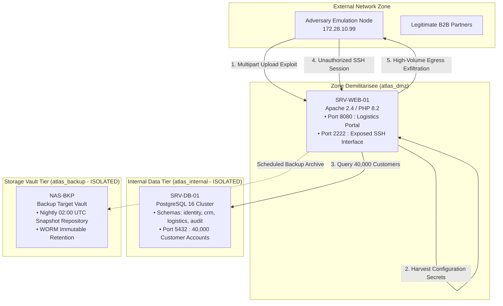

# Project Atlas-SecOps: Enterprise Threat Emulation, Detection Engineering & Automated DFIR Platform

[](.github/workflows/devsecops-pipeline.yml)
[](docs/mitre_attack_matrix.md)
[](telemetry/rules/)
[](incident-response/artifacts/notification_cnil_rgpd_art33.md)
[](docker-compose.yml)
[](LICENSE)

An enterprise-grade, end-to-end Blue Team, Detection Engineering, and DevSecOps laboratory. Built to simulate an advanced targeted server compromise (Incident Reference: INC-ATLAS-001), perform multi-sensor SIEM/EDR telemetry correlation, orchestrate automated network containment (SOAR-as-Code), preserve forensic chain-of-custody (RFC 3227 / NIST SP 800-86), fulfill statutory regulatory filings (GDPR Article 33/34 / NIS2), and deploy hardened, immutable Infrastructure-as-Code.

---

## Table of Contents
- [1. Executive Overview](#1-executive-overview)
- [2. Threat Model & Killchain Mapping](#2-threat-model--killchain-mapping)
- [3. Multi-Tier Architecture & Segmentation](#3-multi-tier-architecture--segmentation)
- [4. Quickstart Execution Guide](#4-quickstart-execution-guide)
- [5. Automated Adversary Simulation (Purple Teaming)](#5-automated-adversary-simulation-purple-teaming)
- [6. Detection Engineering Catalog (Detection-as-Code)](#6-detection-engineering-catalog-detection-as-code)
- [7. DFIR & SOAR Orchestration Engine](#7-dfir--soar-orchestration-engine)
- [8. Digital Forensics & RFC 3227 Chain-of-Custody](#8-digital-forensics--rfc-3227-chain-of-custody)
- [9. Crisis Management & Regulatory Compliance](#9-crisis-management--regulatory-compliance)
- [10. Hardened Production Baseline & Defense-in-Depth](#10-hardened-production-baseline--defense-in-depth)
- [11. DevSecOps CI/CD Automated Security Gates](#11-devsecops-cicd-automated-security-gates)
- [12. Repository Structure](#12-repository-structure)
- [13. Academic Context & Authors](#13-academic-context--authors)

---

## 1. Executive Overview

During an overnight monitoring window, multiple security sensors triggered across the digital supply chain infrastructure of Atlas Distribution S.A. (a high-volume logistics and e-commerce operator managing 40,000 active customer records):

- **T+00m (23:40 UTC)**: EDR detection of an anomalous shell process (`/bin/sh`) spawned under the web server user (`www-data`) on SRV-WEB-01.
- **T+07m (23:47 UTC)**: SIEM alert: Successful SSH login using the automation service account `svc-backup` originating from an unrecognized external IP address.
- **T+15m (23:55 UTC)**: File Integrity Monitor (FIM) identifies an unapproved PHP script (`c99_session_manager.php`) placed inside `/var/www/html/uploads/`.
- **T+30m (00:10 UTC)**: NetFlow sensor records an outbound network egress volume surge approximately **10 times higher than the rolling operational baseline**.
- **T+35m (00:15 UTC)**: On-call SOC analyst correlates the four independent indicators, formalizes incident **INC-ATLAS-001**, and qualifies the event as **P1 - CRITICAL**.

This repository provides a complete, runnable security engineering laboratory that models the affected infrastructure, executes the full adversary killchain, provides production-ready detection rules, automates incident response runbooks via Python SOAR tooling, and redeploys the platform into a hardened zero-trust baseline.

---

## 2. Threat Model & Killchain Mapping

The simulation reproduces all tactics of the enterprise intrusion lifecycle, mapped directly to MITRE ATT&CK:

```
[Perimeter Ingress] ──> [Webshell Placement] ──> [Execution & Discovery] ──> [Lateral Movement] ──> [Exfiltration]
    (T1190)                 (T1505.003)              (T1059.004 / T1082)            (T1021.004)          (T1048.003)
```

| Attack Stage | Tactic | Technique Name | MITRE ID | Realized Scenario Action | Detection Signature |
| :--- | :--- | :--- | :--- | :--- | :--- |
| **Reconnaissance** | Discovery | Network Service Scanning | [T1046](https://attack.mitre.org/techniques/T1046/) | Ingress port sweep targeting TCP 8080, 2222, 5432 | [Suricata IDS](telemetry/rules/suricata/atlas_suricata.rules) |
| **Initial Access** | Initial Access | Exploit Public-Facing Application | [T1190](https://attack.mitre.org/techniques/T1190/) | Multipart POST to `/upload.php` bypassing MIME validation | Web Access Logs |
| **Persistence** | Persistence | Server Software Component: Web Shell | [T1505.003](https://attack.mitre.org/techniques/T1505/003/) | Script dropped in `/var/www/html/uploads/` | [Sigma Rule](telemetry/rules/sigma/file_event_webshell_upload.yml) |
| **Execution** | Execution | Command and Scripting: Unix Shell | [T1059.004](https://attack.mitre.org/techniques/T1059/004/) | System discovery commands executed under `www-data` | [Sigma Rule](telemetry/rules/sigma/proc_creation_php_shell.yml) |
| **Discovery** | Discovery | System Information Discovery | [T1082](https://attack.mitre.org/techniques/T1082/) | Execution of `id`, `uname -a`, `/etc/passwd` enumeration | [Sigma Rule](telemetry/rules/sigma/proc_discovery_linux_system_info.yml) |
| **Credential Access** | Credential Access | Credentials in Files | [T1552.001](https://attack.mitre.org/techniques/T1552/001/) | Plaintext harvesting of `db.php` and `/opt/scripts/backup.sh` | [Falco Rule](telemetry/rules/falco/atlas_falco_rules.yaml) |
| **Lateral Movement** | Lateral Movement | Remote Services: SSH | [T1021.004](https://attack.mitre.org/techniques/T1021/004/) | Unauthorized SSH session using compromised `svc-backup` | [Sigma Rule](telemetry/rules/sigma/ssh_service_account_external_login.yml) |
| **Exfiltration** | Exfiltration | Exfiltration Over Alternative Protocol | [T1048.003](https://attack.mitre.org/techniques/T1048/003/) | Bulk dump of 40,000 PII records creating 10x egress surge | [Sigma Rule](telemetry/rules/sigma/net_anomalous_egress_traffic.yml) |

---

## 3. Multi-Tier Architecture & Segmentation

The infrastructure enforces network layer separation using Docker bridge networks, isolating the DMZ from internal database clusters and backup storage:



---

## 4. Quickstart Execution Guide

The entire simulation, detection, forensics, and remediation workflow is orchestrated via the project `Makefile`:

```bash
# 1. Build and boot the multi-tier enterprise infrastructure
make up

# 2. Inspect running cluster topology, listening sockets, and telemetry
make status

# 3. Launch purple team adversary simulation (8-stage killchain)
make attack

# 4. Execute DFIR triage wizard (Calculates P1 severity & GDPR 72h timer)
make qualify

# 5. Apply live network containment via iptables (preserves volatile RAM)
make isolate

# 6. Acquire volatile memory, sockets, logs, and compute SHA-256/SHA-512 manifest
make collect

# 7. Revoke compromised credentials, purge SSH keys, rotate DB password
make revoke

# 8. Print chronological incident journal (Main Courante)
make timeline

# 9. Verify pre-production security criteria (Checklist Q11)
make verify

# 10. Generate GDPR Article 33 CNIL filing draft and Executive Post-Mortem
make report

# 11. Deploy post-remediation hardened infrastructure baseline
make harden
```

---

## 5. Automated Adversary Simulation (Purple Teaming)

The automated script [`attack/attack_simulation.py`](attack/attack_simulation.py) executes the adversary killchain deterministically without external tools:

```bash
python3 attack/attack_simulation.py --url http://localhost:8080 --speed fast --records 500
```

### Execution Telemetry Generated:
1. **TCP Port Scan (T1046)**: Probing ports 8080, 2222, and 5432.
2. **Multipart Upload (T1190)**: Bypassing file upload restrictions on `/upload.php` to drop `c99_session_manager.php`.
3. **Execution Trigger (T1059.004)**: Invoking `system("id && uname -a && cat /etc/passwd")` through the web shell.
4. **Credential Harvesting (T1552.001)**: Reading plaintext database parameters in `db.php` and backup paths in `/opt/scripts/backup.sh`.
5. **SSH Lateral Movement (T1021.004)**: Emulating an external SSH authentication handshake targeting account `svc-backup`.
6. **Customer DB Exfiltration (T1048.003)**: Querying `crm.customers` on `SRV-DB-01` to stream customer records and trigger egress anomaly alerts.
7. **Anti-Forensics (T1070.004)**: Attempting timestomping (`touch -r`) on the uploaded payload.

---

## 6. Detection Engineering Catalog (Detection-as-Code)

All detection rules are managed as code in industry-standard formats:

### Sigma HQ Rules ([`telemetry/rules/sigma/`](telemetry/rules/sigma/))
- **`proc_creation_php_shell.yml`**: Detects shell interpreters (`sh`, `bash`, `python`) spawned by web servers (Apache / PHP-FPM).
- **`file_event_webshell_upload.yml`**: Alerts on creation of executable scripts (`.php`, `.phtml`, `.sh`) inside upload landing zones.
- **`ssh_service_account_external_login.yml`**: Detects SSH logins using service accounts (`svc-backup`) originating from non-bastion IPs.
- **`net_anomalous_egress_traffic.yml`**: Identifies outbound network transfers exceeding rolling statistical baselines.
- **`proc_discovery_linux_system_info.yml`**: Flags system enumeration utilities executed under `www-data`.
- **`file_credential_harvesting_configs.yml`**: Detects unauthorized read operations on configuration files and backup scripts.
- **`db_mass_record_extraction_anomaly.yml`**: Detects bulk database queries indicative of unauthorized data harvesting.

### CNCF Falco eBPF Kernel Rules ([`telemetry/rules/falco/`](telemetry/rules/falco/atlas_falco_rules.yaml))
- Real-time kernel syscall tracing inspecting `execve`, `openat`, and descriptor socket writes for immediate container anomaly detection.

### Suricata Network Signatures ([`telemetry/rules/suricata/`](telemetry/rules/suricata/atlas_suricata.rules))
- NIDS signatures matching multipart webshell byte sequences, unauthorized command execution parameters, and anomalous outbound egress payloads.

### Linux Auditd Rules ([`telemetry/auditd/`](telemetry/auditd/audit.rules))
- Kernel-level audit rules monitoring modifications to `/etc/passwd`, `/etc/shadow`, `/opt/scripts/`, and SSH authorized keys.

---

## 7. DFIR & SOAR Orchestration Engine

The command-line tool [`incident-response/cli/atlas_ir.py`](incident-response/cli/atlas_ir.py) automates the primary DFIR playbooks defined in the Incident Response Plan:

```
Subcommands:
  status    - Live health check, socket inspection, and upload directory scan
  qualify   - Multi-signal correlation, P1-P4 triage matrix, and GDPR 72h timer
  isolate   - Non-destructive network quarantine via iptables (preserves RAM)
  collect   - RFC 3227 volatile evidence acquisition and cryptographic manifest
  revoke    - Service account locking, SSH key purge, and database secret rotation
  timeline  - Chronological Incident Journal (Main Courante)
  verify    - Pre-production security checklist validation (Checklist Q11)
  report    - GDPR Article 33 CNIL filing draft and Executive Post-Mortem
```

---

## 8. Digital Forensics & RFC 3227 Chain-of-Custody

Acquisitions adhere strictly to RFC 3227 (Order of Volatility):
1. **Volatile Network Sockets**: Captured via `ss -antp`.
2. **Volatile Process Hierarchy**: Captured via `ps auxf`.
3. **Application Logs**: Server stdout/stderr secured via container telemetry.
4. **Dropped Malware Payloads**: Extracted from `/var/www/html/uploads/`.
5. **Storage Safeguard**: Enforcing read-only freeze on `NAS-BKP` to prevent overwriting uncorrupted historical backups.

Each acquisition generates a cryptographic manifest (`evidence_manifest.json`) recording both **SHA-256** and **SHA-512** integrity hashes.

---

## 9. Crisis Management & Regulatory Compliance

### GDPR / RGPD Article 33 (72-Hour Breach Notification)
Under Article 33, a personal data breach involving 40,000 customer accounts requires formal notification to the supervisory authority (**CNIL** in France) within **72 hours** of becoming aware of the event.

- **Incident Discovered**: Friday 23:40 UTC
- **Formally Qualified**: Saturday 00:15 UTC
- **Notification Deadline**: Tuesday 00:15 UTC (T + 72h)

Pre-formatted regulatory filings are generated automatically:
- [`incident-response/artifacts/notification_cnil_rgpd_art33.md`](incident-response/artifacts/notification_cnil_rgpd_art33.md): Formal CNIL notification filing.
- [`incident-response/templates/customer_communication_template.md`](incident-response/templates/customer_communication_template.md): Article 34 individual notification letter.
- [`incident-response/templates/incident_postmortem_atlas.md`](incident-response/templates/incident_postmortem_atlas.md): Complete Post-Mortem & 5 Whys Root Cause Analysis.

---

## 10. Hardened Production Baseline & Defense-in-Depth

Deploying the hardened tier via `make harden` activates [`docker-compose.hardened.yml`](docker-compose.hardened.yml):

| Security Vector | Vulnerable Baseline | Hardened Production Baseline |
| :--- | :--- | :--- |
| **SSH Management Daemon** | Exposed on public port 2222 | **Completely purged from web container** |
| **Upload Script Execution** | PHP script execution enabled | **`php_admin_flag engine off` enforced** |
| **Container Privilege** | Default container capabilities | **`cap_drop: ALL`, only bind service added** |
| **Privilege Escalation** | Default | **`no-new-privileges:true` active** |
| **Execution User** | Elevated root wrapper | **Unprivileged `www-data` (UID 33)** |
| **HTTP Security Headers** | Default | **CSP, HSTS, X-Frame-Options, X-Content-Type** |
| **Database Credentials** | Hardcoded in web root `db.php` | **Injected via runtime environment variables** |

---

## 11. DevSecOps CI/CD Automated Security Gates

The repository includes a GitHub Actions workflow ([`.github/workflows/devsecops-pipeline.yml`](.github/workflows/devsecops-pipeline.yml)) enforcing automated security quality gates:

- **Secret Detection**: Gitleaks scanning preventing credentials from entering version control.
- **SAST (Static Analysis)**: Semgrep OSS scanning for OWASP Top 10 vulnerabilities.
- **Container Scanning**: Aqua Security Trivy scanning Dockerfiles and container configurations.
- **IaC Scanning**: Checkov validating Docker Compose and infrastructure definitions.
- **Detection-as-Code Linter**: `sigma-cli` validating syntax and schema compliance for all Sigma rules.

---

## 12. Repository Structure

```
SOC-lab/
├── README.md                          # Master architectural specification
├── Makefile                           # Automated build, attack, and IR test harness
├── docker-compose.yml                 # Multi-tier vulnerable baseline infrastructure
├── docker-compose.hardened.yml        # Post-remediation hardened production baseline
├── app/                               # SRV-WEB-01 Web Application Tier
│   ├── Dockerfile                     # Baseline container image (SSH & upload flaw)
│   ├── Dockerfile.hardened            # Remediated zero-trust container image
│   ├── entrypoint.sh                  # Service bootstrap script
│   ├── config/
│   │   ├── vhost.conf                 # Baseline Apache virtual host
│   │   └── hardened-vhost.conf        # Hardened Apache virtual host (engine off in /uploads)
│   └── src/
│       ├── index.php                  # Enterprise logistics store dashboard
│       ├── upload.php                 # Vulnerable file upload endpoint
│       ├── db.php                     # Database connector
│       ├── metrics.php                # Prometheus telemetry exporter endpoint
│       ├── api/                       # REST API microservices
│       │   └── orders.php             # Logistics order query endpoint
│       └── uploads/                   # Upload landing zone
├── db/                                # SRV-DB-01 Database Tier
│   └── init.sql                       # PostgreSQL enterprise multi-schema architecture
├── nas-bkp/                           # NAS-BKP Backup Storage Tier
│   └── Dockerfile                     # Alpine SFTP backup vault
├── telemetry/                         # Detection Engineering
│   ├── auditd/                        # Linux kernel auditd rules
│   │   └── audit.rules
│   └── rules/
│       ├── sigma/                     # Sigma rule catalog (T1059, T1505, T1021, T1048, etc.)
│       ├── falco/                     # Falco runtime syscall rules
│       ├── suricata/                  # Suricata NIDS network signatures
│       └── yara/                      # YARA memory and disk scanning signatures
├── attack/                            # Adversary Emulation (Purple Teaming)
│   ├── attack_simulation.py           # 8-stage automated killchain reproducer
│   └── payloads/
│       └── webshell.php               # Standalone verification payload
├── incident-response/                 # DFIR & SOAR Toolkit
│   ├── cli/
│   │   └── atlas_ir.py                # Python DFIR orchestration CLI
│   ├── playbooks/                     # Operational runbooks
│   │   ├── 01_qualification_triage.md
│   │   ├── 02_containment_isolation.sh
│   │   ├── 03_forensic_evidence_collection.sh
│   │   ├── 04_credential_revocation.sh
│   │   └── 05_recovery_verification.md
│   ├── templates/                     # Crisis communication & regulatory deliverables
│   │   ├── customer_communication_template.md
│   │   └── incident_postmortem_atlas.md
│   └── artifacts/                     # Forensic outputs & chain-of-custody manifests
└── docs/                              # Architecture, RACI & Compliance Documentation
    ├── architecture.md
    ├── mitre_attack_matrix.md
    ├── raci_matrix.md
    ├── main_courante_timeline.md
    ├── threat_model_stride.md
    ├── framework_alignment.md
    └── adr/                           # Architecture Decision Records (ADR 001 - 003)
```

---

## 13. Academic Context & Authors
- **Authors:** Anouar Mohamed & Zakaria Bouzouba (Group 2)
- **Academic Reference:** TP Reponse aux Incidents - Scenario Atlas Distribution (1er Octobre 2026)
- **Technical Domains:** Security Operations (SOC), Digital Forensics & Incident Response (DFIR), Detection Engineering, DevSecOps.
- **License:** Apache License 2.0
