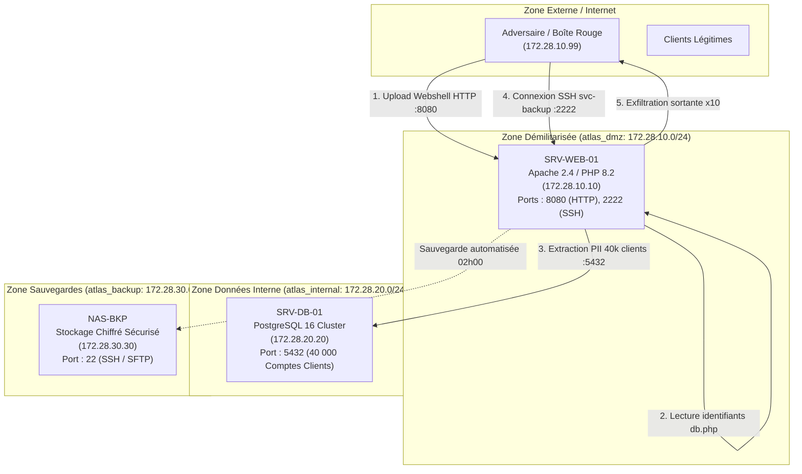

# Infrastructure & Threat Architecture (Scenario INC-ATLAS-001)

## 1. Vue d'Ensemble du Réseau et Segmentation

L'infrastructure d'Atlas Distribution reproduite dans ce laboratoire modélise un environnement de production d'entreprise segmenté en trois sous-réseaux virtuels isolés :

---

## 2. Décomposition des Nœuds d'Infrastructure

### 2.1 SRV-WEB-01 (Nœud Applicatif E-Commerce)
- **Rôle :** Serveur web public hébergeant la boutique en ligne et le portail de dépôt documentaire partenaire.
- **Adresse IP :** `172.28.10.10` (DMZ), `172.28.20.10` (Accès base), `172.28.30.10` (Accès backup).
- **Faiblesses architecturales initiales :**
  - Dossier `/var/www/html/uploads/` accessible en écriture et autorisant l'interprétation PHP directe.
  - Démon SSH actif et exposé directement sur le port public 2222.
  - Compte de service d'automatisation `svc-backup` doté de droits SSH interactifs et mot de passe réutilisable.
  - Identifiants de connexion PostgreSQL stockés en clair dans `db.php` sous la racine web.

### 2.2 SRV-DB-01 (Nœud Base de Données)
- **Rôle :** Instance PostgreSQL 16 isolée sur le sous-réseau `atlas_internal`.
- **Adresse IP :** `172.28.20.20`.
- **Données hébergées :** 40 000 profils clients synthétiques (nom, prénom, e-mail, téléphone, adresse de livraison, hash bcrypt de mot de passe, jeton bancaire tronqué).

### 2.3 NAS-BKP (Nœud Coffre de Sauvegarde)
- **Rôle :** Serveur de stockage cible des sauvegardes applicatives et de bases de données, exécuté chaque nuit à 02h00 UTC par `svc-backup`.
- **Adresse IP :** `172.28.30.30`.
- **Politique de conservation :** 30 jours tournants + sauvegarde froide hebdomadaire hors ligne.
