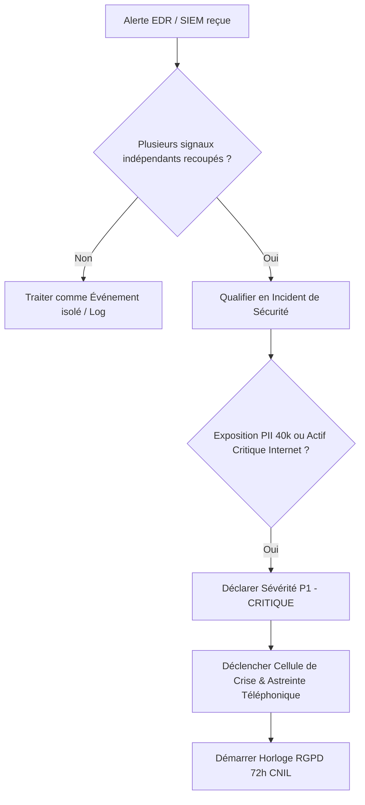

# Playbook 01 : Qualification & Triage de l'Incident (Niveau P1)

## 1. Objectifs
- Établir la distinction formelle entre Événement, Incident et Crise.
- Corréler les signaux EDR, SIEM, FIM et NetFlow en moins de 35 minutes.
- Activer l'astreinte et engager les délais légaux (RGPD 72h).

---

## 2. Matrice d'Évaluation de la Sévérité

| Niveau | Critères d'Impact | Escalade Immédiate | SLA de Prise en Compte |
| :--- | :--- | :--- | :--- |
| **P1 - Critique** | Actif critique exposé compromis, fuite possible de données personnelles, compte à privilège compromis | Incident Manager, RSSI, DSI, Direction, DPO | **30 min (Appel vocal)** |
| **P2 - Majeur** | Compromission avérée d'un système important, sans impact immédiat sur les données clients | Incident Manager, RSSI | 1 heure |
| **P3 - Modéré** | Compromission d'un actif non critique, impact localisé, aucune donnée sensible | Incident Manager | 4 heures |
| **P4 - Mineur** | Événement isolé, faux positif potentiel, sonde défaillante | Analyste SOC | Jour ouvré suivant (24 h) |

---

## 3. Matrice de Fiabilité des IOC (Du plus au moins fiable)

1. **Connexion SSH réussie de `svc-backup` depuis une IP externe non répertoriée**
   - *Fiabilité :* **Très élevée** (Faible taux de faux positifs ; authentification réussie anormale).
2. **Script inhabituel déposé dans `/var/www/html/uploads/`**
   - *Fiabilité :* **Élevée** (Artefact concret et analysable statiquement / hashable).
3. **Surge de trafic sortant x10 (NetFlow / Pare-feu)**
   - *Fiabilité :* **Moyenne à Élevée** (Nécessite corrélation avec la destination IP et le protocole).
4. **Processus inhabituel signalé par l'EDR sous `www-data`**
   - *Fiabilité :* **Moyenne** (Alerte heuristique à corréler avec les logs d'accès web).

---

## 4. Arbre de Décision

